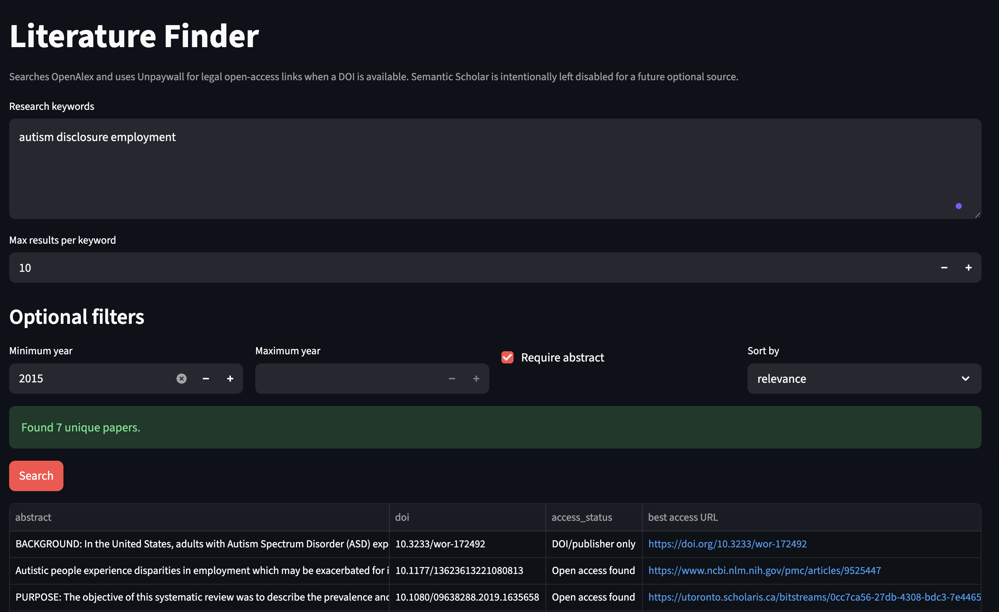

# Literature Finder

## App Screenshot




Literature Finder is a Python and Streamlit tool for finding academic papers and legal access links from scholarly metadata APIs.

## Features

- Search scholarly literature from a local Streamlit app.
- Run an existing command-line workflow from `main.py`.
- Query OpenAlex for paper metadata, abstracts, DOI links, citation counts, publication years, venues, and authors.
- Use Unpaywall in the Streamlit app to find legal open-access links when a DOI is available.
- Deduplicate results by DOI or title.
- Rank or sort results by relevance, citation count, or year.
- Export results to CSV or Markdown.
- Include access fields such as `access_status` and `best_access_url`.

## What It Does

Literature Finder helps you turn a list of research keywords into a structured list of papers. It is useful for early literature review discovery, portfolio demos, research-methods coursework, and project scoping. The Streamlit app is the easiest way to search interactively and download results. The CLI workflow is useful when you want repeatable output from a saved `keywords.txt` file.

The project focuses on autism, education, STEM, employment, disclosure, accommodations, interviews, and related literature by default, but you can replace the keywords with any research topic.

## What It Does Not Do

- It does not replace reading the paper, abstract, methods, or full text before citing a source.
- It does not guarantee that every relevant paper will be found.
- It does not evaluate study quality or evidence strength.
- It does not scrape Google Scholar.
- It does not download copyrighted PDFs.
- It does not bypass paywalls.

## Data Sources

- [OpenAlex](https://openalex.org/) for scholarly works metadata and open-access metadata.
- [Unpaywall](https://unpaywall.org/) for legal open-access links when a DOI is available in the Streamlit app.

The command-line workflow in `main.py` can also use Semantic Scholar if you explicitly select it with `--source all` or `--source semantic-scholar`, but OpenAlex is the recommended default for release use.

## Legal And Ethical Note

This project is designed to use legitimate academic APIs and legal access links. It does not scrape Google Scholar, does not download copyrighted PDFs, and does not provide paywall bypasses. Links may point to DOI pages, publisher landing pages, OpenAlex open-access URLs, Unpaywall open-access URLs, or PubMed Central pages when those legal links are available.

## Mac Installation

Open Terminal and clone or download this project. If it is already in your Documents folder, move into the project directory:

```bash
cd ~/Documents/autism-lit-search
```

Create and activate a virtual environment:

```bash
python3 -m venv .venv
source .venv/bin/activate
```

Install dependencies:

```bash
python3 -m pip install --upgrade pip
python3 -m pip install -r requirements.txt
```

Optional but recommended: set an email address for API etiquette. OpenAlex encourages a contact email, and Unpaywall requires an email parameter.

```bash
export OPENALEX_MAILTO="your_email@example.com"
export UNPAYWALL_EMAIL="your_email@example.com"
```

## Run The Streamlit App

From the project directory:

```bash
source .venv/bin/activate
streamlit run app.py
```

The app opens a local page named **Literature Finder**. Enter one keyword or search phrase per line, choose filters, run the search, review the table, and download CSV or Markdown results.

## Run The CLI Workflow

Edit `keywords.txt` so it contains one search phrase per line. Then run the recommended OpenAlex workflow:

```bash
source .venv/bin/activate
python main.py --source openalex
```

By default, the CLI writes:

- `literature_results_interview_targeted.csv`
- `literature_results_interview_targeted.md`

These generated result files are intentionally ignored by Git and should not be committed.

For a smaller test run:

```bash
python main.py --source openalex --limit 3
```

To choose custom output paths:

```bash
python main.py --source openalex --csv my_results.csv --md my_results.md
```

## Example Keywords

```text
autism disclosure employment
autistic college students STEM
autism job interview
autistic adults workplace accommodations
autism masking employment interview
neurodiversity hiring bias
autistic students career transition
```

## Testing

Run the existing unit tests with:

```bash
python -m unittest discover -s tests
```

## Citation And Portfolio Blurb

Literature Finder is an open-source Python and Streamlit project that searches OpenAlex, enriches DOI-based results with Unpaywall legal access links, and exports structured literature review results for research discovery workflows.

If you use or adapt this project, cite it as:

```text
Literature Finder. 2026. Open-source Python and Streamlit literature discovery tool using OpenAlex and Unpaywall.
```
